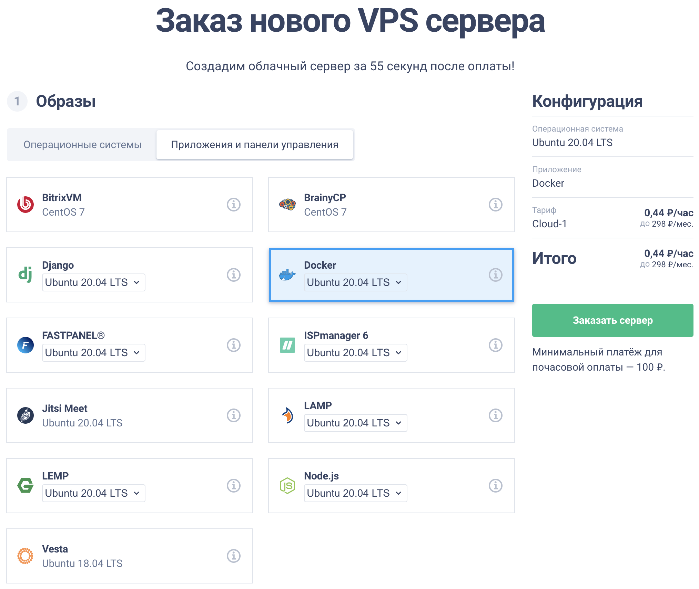

# Torrent Manager
MVP v. 0.1.10
#### Наша группа в Telegram: https://t.me/btt_manager

+ [Как использовать скрипт](#info);
+ [Как заработать больше](#money);
+ [Запуск μTorrent в Docker](#docker);
+ [Вывод на Binance](#binance);
+ [Скачивание через qBittorrent](#QBittorrent);
+ [Полезные ссылки](#links).

_**Donate:**_
- TRX/BTT: _**TSyujStera3SMSxuntzqAaf5y4SBzwnm23**_
- VISA SBERBANK: _**4274 3200 4502 9926**_
- Speed/BTFS IN APP: _**BHZJ3obt9IYWJWO8r1wQwhpmGpMHjgru1QhZRNq50o30K0FuDF3DaAeI8Wc9fChkjLyFbtH8ajdeLjZiVwEH3rU=**_

_**Donate за автоматическое удаление файлов:**_
- TRX/BTT: _**TNZjNWimuExCSxggqk7Z2QvpaCw1GifM74**_
- Speed/BTFS IN APP: _**BKEroKV+R46PbDhvDIrcYcmbtkkdscMdWF/Y8nKLEkMu63JA4ZyINiECykGUe43OtHrg8Z2XLbnbiGDRKk7ZQxI=**_

<a name="info">Как использовать скрипт</a>
-------------------------
На сегодняшний день поддержка BTT есть только у клиентов μTorrent/BitTorrent/Web(LibTorrent) последних версий.
Для увеличения шанса получения BTT необходимо ограничить количество других клиентов.
Данный скрипт блокирует другие клиенты по их названию и версии.
Инструкция по использованию:

1. Качаем и устанавливаем NodeJS версию LTS: https://nodejs.org/ru/ или [для windows 7](https://www.centennialsoftwaresolutions.com/post/install-node-js-on-windows-7)
2. Качаете [этот репозиторий](https://github.com/aliasxrus/torrent-manager) (Если нет гита то нажимаете сверху кнопку Code и выбираете Download zip, затем извлекаете и переходите в папку).
3. В торрент клиенте открываете _**настройки -> дополнительно -> веб интерфейс**_, указываете логин, пароль и порт (придумать самим, порт лучше в диапазоне от 20000 до 60000).
4. Находите среди файлов скрипта _**config.js**_ и открываете в любом современном текстовом редакторе, заполняете поля как в пункте выше. Удобнее всего редактировать через [Notepad++](https://notepad-plus-plus.org/downloads/)
5. Для запуска программы используйте _**START.bat**_

Инструкция от @Sandra2Z для старой версии https://telegra.ph/Kak-zapustit-skript-ot-Kharis-Shamsuarov-cherez-komandnuyu-stroku-04-25
    
Это просто демонстрация, нормальная версия будет чуть позже. Тут куча багов и ошибок!!!

<a name="money">Как заработать больше</a>
-------------------------
Самый простой способ заработка это увеличить количество раздающих компьютеров.
При желании можно взять _**[VPS](https://zomro.com/vds.html?from=294244)**_ в аренду, проверенные виртуальные сервера можно арендовать на _**[ZOMRO](https://zomro.com/vds.html?from=294244)**_.
Рекомендую тариф _**VDS/VPS «MEGA»**_ c SSD до 100Gb с операционной системой Windows. Средний срок окупаемости до недели. Для более стабильной работы торрент клиента лучше использовать Windows-Server-2012-R2-RUS.

Протестированные VPS:
- _**[FirstByte](https://firstbyte.ru/?from=80394)**_
- _**[ZOMRO](https://zomro.com/vds.html?from=294244)**_
- _**[Planetahost](https://planetahost.ru/)**_
- _**[MaCloud](https://macloud.ru/?partner=qby7f922cx)**_
- _**[VdsSh](http://vds.sh/?u=38277)**_

Лучшие Linux сервера у _**[REG.RU](https://www.reg.ru/vps/cloud/?rlink=reflink-6666127)**_

Черный список:
- _**[Vultr](https://www.vultr.com/?ref=8882663)**_ (почасовая оплата, частые блокировки)
- ZetaLink (частые блокировки, но деньги возвращают)
- MaCloud (меняют условия задним числом и загоняют баланс в минус, техподдержка неадекватна)

<a name="docker">Запуск μTorrent в Docker</a>
-------------------------
1. Регистрируемся в _**[REG.RU](https://www.reg.ru/vps/cloud/?rlink=reflink-6666127)**_
2. Берем в аренду облачный сервер _**[REG.RU](https://www.reg.ru/vps/cloud/?rlink=reflink-6666127)**_ промокод на скидку _**9737-44AE-4C48-1361**_, для первого раза лучше взять тариф _**Cloud-3b**_, далее достаточно _**Cloud-1**_. Нам необходим VPS с предустановленным Docker, выбираем как указано как на картинке: 
3. Скачиваем и подключаемся к серверу _**[PuTTY](https://www.putty.org/)**_, инструкция по использованию: https://www.youtube.com/watch?v=I1YfpvdHv4k Если возникнут трудности то можно посмотреть [другие инструкции](https://www.youtube.com/results?search_query=windows+putty+ssh+%D0%B8%D0%BD%D1%81%D1%82%D1%80%D1%83%D0%BA%D1%86%D0%B8%D1%8F). Для вставки текста из буфера обмена в PuTTY можно используется правый клик мыши по окну с терминалом.
4. После подключения копируем и вставляем команду:
```shell
docker run -it \
  --name ut \
  -p 30000:30000 \
  -p 45380:45380 \
  -p 45381:3389/tcp \
  -e LANG=C.UTF-8 \
  -e LC_ALL=C.UTF-8 \
  --hostname="$(hostname)" \
  --env="RDP_SERVER=yes" \
  -d \
  scottyhardy/docker-wine /bin/bash
```
Где:
 - _**--name ut**_ - название контейнера
 - _**-p 30000:30000**_ - порт для входящий соединений торрент клиента, можно сменить при условии смены в торент клиенте во вкладке _**Соединение**_. Все значения должны совпадать.
 - _**-p 45380:45380**_ - порт для доступа к веб интерфейсу, для открытия страницы в браузере. Если он вам не нужен, желательно удалить эту строчку. При открытии доступа в сеть необходимо сменить порт, логин, пароль в торрент клиенте: _**настройки -> дополнительно -> веб интерфейс**_. Не забудьте сменить эти данные в _**config.yaml**_ блокировщика.
 - _**-p 45381:3389/tcp**_ - порт для подключения через _**RDP**_. Меняем только первое число.

5. Подключаемся по _**RDP**_ указывая _**IP_СЕРВЕРА:ПОРТ_RDP**_ пример: 111.111.111.111:45381. Логин и пароль: _**wineuser**_
6. Открываем терминал: 
7. Выполняем команду:
```shell
git clone https://github.com/aliasxrus/go-torrent-manager.git /home/wineuser/tm &&
chmod +x /home/wineuser/tm/torrent-manager-linux
```
8. Запускаем μTorrent, окно терминала сворачиваем:
```shell
LANG=C.UTF-8 wine /home/wineuser/tm/ut/uTorrent.exe
```
9. После запуска μTorrent, запускаем блокировщик в новом окне терминала:
```shell
CONFIG_PATH=/home/wineuser/tm/ut/config.yaml /home/wineuser/tm/torrent-manager-linux
```
10. Команда для редактирования _**config.yaml**_ блокировщика, после внесения изменений необходимо сохранить и перезапустить блокировщик:
```shell
notepad /home/wineuser/tm/ut/config.yaml
```
11. Обязательно меняем пароль пользователя для _**RDP**_, в _**RDP**_ открываем ещё один терминал (как в пункте 6) и вводим команду. https://losst.ru/kak-smenit-parol-v-linux
```shell
passwd
```
12. Ссылка для доступа к веб интерфейсу http://IP_СЕРВЕРА:ПОРТ_ВЕБ_ИНТЕРФЕЙСА/gui/ пример: http://111.111.111.111:45380/gui/

<a name="binance">Вывод на Binance</a>
-------------------------
Первым делом регистрируемся на _**[Binance](https://www.binance.com/ru/register?ref=140122449)**_.
Для возможности перевода на кошелек нужно:
   - перечисляем на кошелек в торрент клиенте 0.1 TRX. Их можно купить на _**[Binance](https://www.binance.com/ru/register?ref=140122449)**_ или попросить в профильных чатах, к примеру https://t.me/BTTBitTorrentRU
   - адрес вашего кошелька указан в _**Кошелек -> Публичный адрес**_ (в правом верхнем углу 3 точки, сразу после "Информация по восстановлению данных")
   - если у вас несколько кошельков BTT, то нужно перевести TRX только на 1 из них. При первом переводе на _**[Binance](https://www.binance.com/ru/register?ref=140122449)**_ он активирует ваш TRX/BTT кошелек на бинансе и можно будет переводить с любых BTT кошельков с торрент клиента.

Перевод на кошелек _**[Binance](https://www.binance.com/ru/register?ref=140122449)**_
   - первым делом необходимо перевести баланс из _**BTT in-app**_ в _**BTT on-chain**_. Это занимает некоторое времени, результат можно посмотреть в _**История**_
   - кошелек бинанса можно найти в _**Кошелек -> Обзор кошелька -> Основной аккаунт**_, тут находим _**BTT**_ через _**Поиск монет**_ и в колонке _**Действие**_ нажимаем кнопку _**Ввод**_.
   - в правой части окна указан ваш кошелек, проверяем что выбран TRC20 и копируем кошелек.
   - далее переводим _**BTT on-chain**_ на бинанс. Для этого в выпадающем меню выбираем _**Другой публичный адрес**_ куда вводим BTT кошелек с бинанса.

Вывод денег на банковскую карту:
   - переходим на _**[BestChange](https://www.bestchange.ru/?p=1226003)**_, сразу под логотипом переходим в _**Список**_ и выбираете что отдаёте BTT и куда собираетесь принять средства. Нажимаем _**Найти лучший курс**_.
   - сайт подберет лучшие по курсу обменники и предложит их на выбор.
   - переходим на обменник, заполняем необходимые поля.
   - переводим с _**[Binance](https://www.binance.com/ru/register?ref=140122449)**_ кошелька _**Кошелек -> Обзор кошелька -> Основной аккаунт**_, тут находим _**BTT**_ через _**Поиск монет**_ и в колонке _**Действие**_ нажимаем кнопку _**Вывод**_.
   - переводим на кошелек обменника и ждём поступления денег.

<a name="QBittorrent">Скачивание через qBittorrent</a>
-------------------------
При скачивании файлов есть опасность потратить свои BTT, они будут потрачены на ускорение скачивания.
Для предотвращения этого можно скачивать торрент другим клиентом и в автоматическом режиме передавать их в μTorrent/BitTorrent.
1. Скачиваем и устанавливаем [QBittorrent](https://www.qbittorrent.org/download.php)
2. Переходим в настройки QBittorrent: Сервис -> Настройки... -> Загрузки
    - указываем _**Путь сохранения по умолчанию**_, это папка куда будут скачиваться торренты. 
    - указываем _**Копировать торрент-файлы завершенных загрузок в**_, сюда будут сохранены торрент файлы для передачи их в μTorrent/BitTorrent.
3. Переходим в настройки QBittorrent: Сервис -> Настройки... -> BitTorrent
   - В самом низу находим _**Ограничения раздачи**_
   - Ставим галку _**По достижению рейтинга раздачи**_ в значение: 0
   - В пункте _**затем**_ выбираем _**Остановить торрент**_
4. Заходим в μTorrent Настройки -> Настройки программы
   - указываем путь _**Помещать загружаемые файлы в**_ как у QBittorrent.
   - ставим галку у пункта _**Automatically load torrents from**_ и указываем путь куда QBittorrent сохраняет торрент файлы.

<a name="links">Полезные ссылки</a>
-------------------------
Полезные ссылки:
   - https://inapp.fun - сервис для работы с IN APP
   - https://t.me/btt_manager - наша группа
   - https://t.me/btt_dev_balance - информация о пополнении шлюза
   - https://github.com/Jackett/Jackett - приложение для подбора торентов + в описание есть хороший список сайтов
   - http://tormon.ru - приложение для подбора торентов
   - https://t.me/BTTdevAMOUNT - информация о пополнении шлюза
   - https://t.me/btt_dashboard - информационное приложение
   - https://t.me/bttexchangewalletbalance - информация о пополнении шлюза
   - https://t.me/btt_manager/98266 - запуск нескольких клиентов
   - https://github.com/TRON-US/go-btfs/releases - клиент для работы с BTFS
   - http://127.0.0.1:5001/hostui/#/wallet - ссылка для входа в кошелёк BTFS
   - https://netcheif.com/Articles/uTorrent/utorrent.html - полезная информация о μTorrent
   - https://tronscan.org/#/exchange/trc20?token=BitTorrent/TRX&id=39 - TRON биржа, можно прикупить TRX за BTT

Шлюзы с которых идёт вывод BTT:
   - [TTZu7wpHa9tnQjFUDrsjgPfXE7fck7yYs5](https://tronscan.org/#/address/TTZu7wpHa9tnQjFUDrsjgPfXE7fck7yYs5) _актуальный_
   - [TA1EHWb1PymZ1qpBNfNj9uTaxd18ubrC7a](https://tronscan.org/#/address/TA1EHWb1PymZ1qpBNfNj9uTaxd18ubrC7a)
