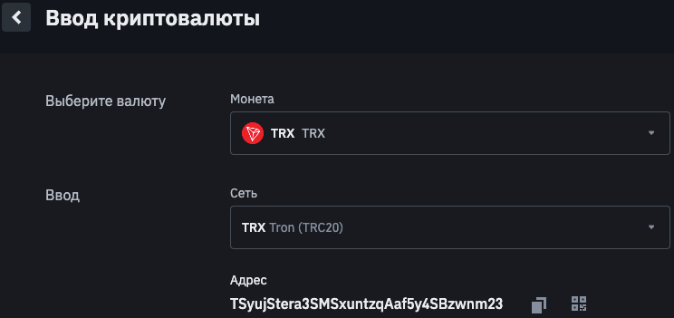
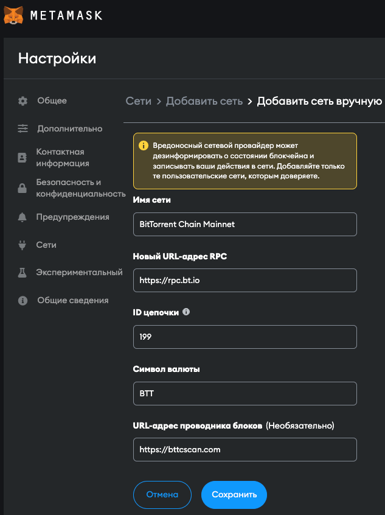
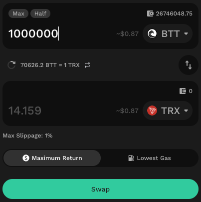
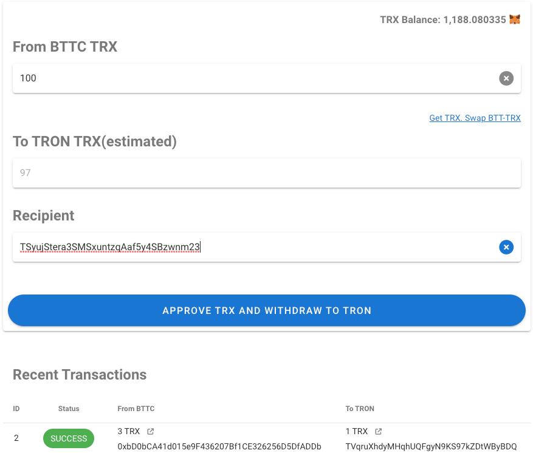
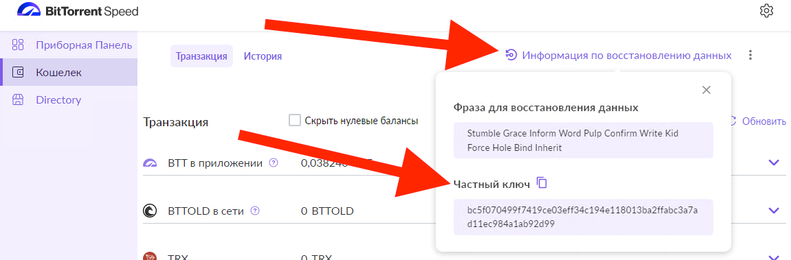

# Вывод из сети BTTC в TRON
#### Наша группа в Telegram: [_**https://t.me/btt_manager**_](https://t.me/btt_manager)
#### Группа TMM.Exchange в Telegram: [_**https://t.me/TakeMyMoneyExchange**_](https://t.me/TakeMyMoneyExchange)

+ [Установка MetaMask](#metaMask)
+ [Сеть TRON](#tronLink)
+ [Добавление сети BTTC в MetaMask](#bttcMetaMask)
+ [Обмен токенов на TRX в сети BTTC](#bttcSwapToTrx)
+ [Вывод TRX из сети BTTC в TRON](#withdrawFromBttcToTron)
+ [Узнать секретный / приватный ключ BitTorrent Speed](#speedKey)
+ [Вывод IN APP BTT из SPEED в сеть BTTC](#withdrawInApp)
+ [Обмен и вывод средств в банк / qiwi и др.](#bestchange)
+ [Сайт TMM.Exchange](https://tmm.exchange)
+ [Сайт Kyberswap](https://kyberswap.com/swap?referral=0xbD0bCA41d015e9F436207Bf1CE326256D5DfADDb&fee_percent=10&inputCurrency=BTT&outputCurrency=0xEdf53026aeA60f8F75FcA25f8830b7e2d6200662&networkId=199)
+ [Сайт Binance](https://www.binance.com/ru/register?ref=140122449)

<a name="metaMask">Установка MetaMask</a>
-------------------------

Для использования сервиса [_**TMM.Exchange**_](https://tmm.exchange) необходимо установить браузерное или мобильное приложение [_**MetaMask**_](https://metamask.io).

Для установки перейдите на сайт [metamask.io](https://metamask.io)

<a name="tronLink">Сеть TRON</a>
-------------------------

Получить перевод можно на любой _**TRON**_ кошелек. Для сети _**TRON**_ рекомендуется использовать кошелёк [_**TronLink**_](https://www.tronlink.org)

Для установки перейдите на сайт [tronlink.org](https://www.tronlink.org)

Для удобства можно переводить _**TRX**_ сразу на кошелёк биржи. К примеру для перевода на _**[Binance](https://www.binance.com/ru/register?ref=140122449)**_ необходимо:
- перейти в _**Кошелек**_
- нажать кнопку _**Ввод**_ и выбрать _**Ввод криптовалюты**_
- выбрать монету _**TRX**_ и сеть _**TRX Tron (TRC20)**_
- будет показан _**Адрес**_ через который можно пополнять счет биржи. Его можно указать в качестве получателя _**TRX**_ на [_**TMM.Exchange**_](https://tmm.exchange)

<a name="bttcMetaMask">Добавление сети BTTC в MetaMask</a>
-------------------------

Для работы с сетью _**BTTC**_ в _**MetaMask**_ необходимо её добавить, есть 2 способа:
1. На [_**TMM.Exchange**_](https://tmm.exchange) подключить _**MetaMask**_ нажатием на кнопку _**Connect MetaMask**_. При первом подключении _**MetaMask**_ предложит подтвердить добавление сети.
2. Добавить сесть вручную:
    - перейти в _**Настройки**_ и выбрать раздел _**Сети**_
    - нажать на кнопку _**Добавить сеть**_, вы попадете в раздел настроек _**Сети > Добавить сеть > Добавить сеть вручную**_
    - заполнить поля:
        - _**Имя сети**_: BitTorrent Chain Mainnet
        - _**Новый URL-адрес RPC**_: https://rpc.bt.io
        - _**ID цепочки**_: 199
        - _**Символ валюты**_: BTT
        - _**URL-адрес проводника блоков**_: https://bttcscan.com
    - нажмите кнопку _**Сохранить**_

<a name="bttcSwapToTrx">Обмен токенов на TRX в сети BTTC</a>
-------------------------

Мост [_**TMM.Exchange**_](https://tmm.exchange) для перевода использует токен _**TRX**_, так как данный токен не требуют энергии для перевода в сети _**TRON**_.

Для всех переводов в сети _**BTTC**_ требуется наличие _**BTT**_ на балансе для оплаты за _**gas**_. Рекомендуется оставлять не менее _**1000 BTT**_ на балансе.

Если у вас есть токены в сети _**BTTC**_ вы можете обменять их на _**TRX**_ на сайте [Kyberswap.com](https://kyberswap.com/swap?referral=0xbD0bCA41d015e9F436207Bf1CE326256D5DfADDb&fee_percent=10&inputCurrency=BTT&outputCurrency=0xEdf53026aeA60f8F75FcA25f8830b7e2d6200662&networkId=199)

Адрес токена _**TRX**_ в сети _**BTTC**_ [_**0xEdf53026aeA60f8F75FcA25f8830b7e2d6200662**_](https://bttcscan.com/token/0xEdf53026aeA60f8F75FcA25f8830b7e2d6200662)

<a name="withdrawFromBttcToTron">Вывод TRX из сети BTTC в TRON</a>
-------------------------

Для использования моста [_**TMM.Exchange**_](https://tmm.exchange) необходимо:
- подключить _**MetaMask**_ нажатием на кнопку _**Connect MetaMask**_
- указать сумму _**TRX**_ для перевода. Для указания всего баланса можно нажать на _**TRX Balance**_
- в поле _**To TRON TRX(estimated)**_ будет указана расчетная сумма к получению в сети _**TRON**_
- в поле _**Recipient**_ необходимо указать адрес кошелька в сети _**TRON**_, подробнее [Сеть TRON](#tronLink)
- запустить вывод нажатием на кнопку _**Approve TRX and withdraw to TRON**_
- подтвердить в _**MetaMask**_ 2 действия, разрешение на доступ к _**TRX**_ и запуск смарт контракта создающего заявку
- после этого в таблице ниже появиться таблица с последними выводами
- далее в течение нескольких минут будет последовательно пройдено 3 этапа: _**CREATED, PENDING, SUCCESS**_
- статус _**SUCCESS**_ означает что все этапы успешно пройдены и сеть _**TRON**_ подтверждает наличие совершенного перевода

Для добавления токена _**TRX**_ и _**TMM**_ в _**MetaMask**_ нажмите на иконку лисы напротив балансов.

Первые месяцы работы сервиса идут бонусные выплаты токенов _**TMM**_ в качестве компенсации комиссии.

Адрес токена _**TMM**_ в сети _**BTTC**_ [_**0x50DFe3D2874E17e6018EFf67d1A5A2dac090686E**_](https://bttcscan.com/token/0x50DFe3D2874E17e6018EFf67d1A5A2dac090686E)

Группа с технической поддержкой и новостями сервиса [_**https://t.me/TakeMyMoneyExchange**_](https://t.me/TakeMyMoneyExchange)

<a name="speedKey">Узнать секретный / приватный ключ BitTorrent Speed</a>
-------------------------

Для осуществления переводов _**IN APP BTT**_ необходимо получить секретный / приватный ключ от BitTorrent Speed. Данный ключ позволяет получить полный доступ к кошельку, держите его в секрете и после использования в сервисах создавайте новый кошелек.

В BitTorrent Speed его можно получить в разделе _**Кошелек -> Информация по восстановлению данных**_:

<a name="withdrawInApp">Вывод IN APP BTT из SPEED в сеть BTTC</a>
-------------------------

Для экономии на комиссии в сети _**TRON**_ при работе с токеном _**BTT**_ можно воспользоваться сервисом [_**in-app.tmm.exchange**_](https://in-app.tmm.exchange)

Данный сервис переводит _**IN APP BTT**_ в _**BTT**_ сети _**BTTC**_, что позволяет сделать обмен на _**TRX**_ для вывода в сеть _**TRON**_ через [_**TMM.Exchange**_](https://tmm.exchange)

Для перевода [_**https://in-app.tmm.exchange/#/bttBuy**_](https://in-app.tmm.exchange/#/bttBuy) необходимо:
- в поле _**Откуда**_ указать приватный ключ или 12 слов от кошелька _**Speed**_ [Узнать секретный / приватный ключ BitTorrent Speed](#speedKey)
- проверить баланс, он будет указан в BTTOLD (в 1000 раз меньше)
- в поле _**Адрес BTTC Network**_ указать адрес вашего кошелька _**MetaMask**_ [Установка MetaMask](#metaMask)
- если вам нужно вывести только часть баланса, то укажите баланс в BTTOLD. Для вывода всего баланса необходимо оставить 0
- запустите контракт

1 BTTOLD = 1000 BTT = 1000 BTTC

<a name="bestchange">Обмен и вывод средств в банк / qiwi и др.</a>
-------------------------

Если вы зарегистрированы на _**[Binance](https://www.binance.com/ru/register?ref=140122449)**_, то проще всего вывести через _**[P2P Binance ](https://p2p.binance.com/ru?ref=140122449)**_.

Если у вас нет желания проходить регистрацию и подтверждение личности можно воспользоваться агрегатором обменников _**[BestChange](https://www.bestchange.ru/?p=1226003)**_.
Для вывода через _**[BestChange](https://www.bestchange.ru/?p=1226003)**_ рекомендую использовать токен TRX, он не требует дополнительной оплаты за перевод при наличии пропускной способности.
