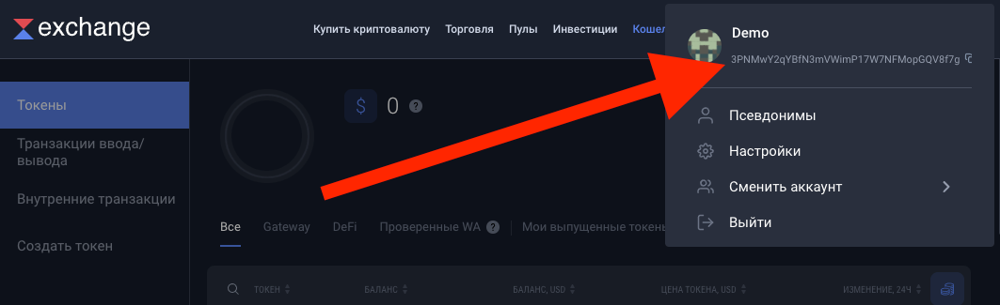
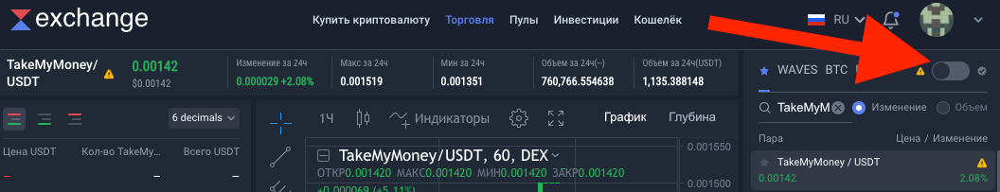
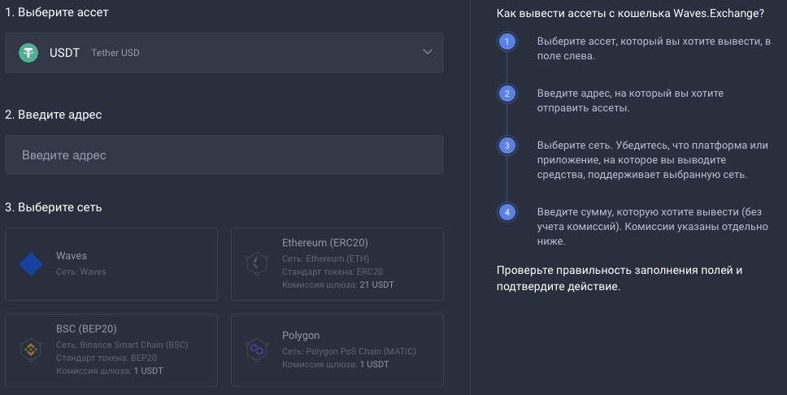

# Работа с IN APP через TakeMyMoney Waves
#### Наша группа в Telegram: https://t.me/btt_manager

+ [Вход на DEX биржу Waves](#waves);
+ [Узнать адрес Waves кошелька](#wavesAddress);
+ [Обмен IN APP на TakeMyMoney Waves](#buyTmm);
+ [Обмен BTTOLD на WebTorrentToken Waves](#buyWtt);
+ [Узнать секретный / приватный ключ BitTorrent Speed](#speedKey);
+ [Продажа TakeMyMoney на бирже Waves](#sellTmmUsdt);
+ [Вывод USDT с биржи Waves](#withdrawUsdt);
+ [Обмен и вывод средств в банк / qiwi и др.](#bestchange);
+ [TakeMyMoney / USDT](https://waves.exchange/trading/spot/CESxeaxm1urc8GgFHF93U6GSF7BU3GuECDPQY75WMdQc_USDT);
+ [TakeMyMoney / WAVES](https://waves.exchange/trading/spot/CESxeaxm1urc8GgFHF93U6GSF7BU3GuECDPQY75WMdQc_WAVES);
+ [TakeMyMoney / WebTorrentToken](https://waves.exchange/trading/spot/CESxeaxm1urc8GgFHF93U6GSF7BU3GuECDPQY75WMdQc_A4nJPPXipvDw7MDRLq5fbj61PwiXkvjcXYGasDLNFvzg);

<a name="waves">Вход на DEX биржу Waves</a>
-------------------------
Для работы с биржей надо только зарегистрироваться, без прохождения дополнительных проверок.

Способы входа на биржу [Waves Exchange](https://waves.exchange):
- Использовать расширение для браузера [Waves Keeper](https://docs.waves.tech/ru/ecosystem/waves-keeper) (наиболее надежный способ);
- Использовать [программный доступ](https://waves.exchange/sign-up/software), будут сгенерированы приватные фразы и ключ от кошелька которые необходимо сохранить в надежном месте;
- Регистрация с использованием [Email](https://waves.exchange/sign-up/email).

<a name="wavesAddress">Узнать адрес Waves кошелька</a>
-------------------------
Для просмотра адреса кошелька войдите на [биржу](https://waves.exchange) и нажмите на свою аватарку.

<a name="buyTmm">Обмен IN APP на TakeMyMoney Waves</a>
-------------------------

Обменять IN APP на TakeMyMoney Waves можно на сайте [InApp.Fun](https://inapp.fun/#/tmmBuy).

Для этого необходимо ввести приватный ключ от кошелька TRON с IN APP и указать адрес Waves кошелька куда будут перечислены TakeMyMoney. 

Сервис не хранит данные кошельков, но в целях безопасности пользоваться TRON кошельком с которого были осуществлены переводы IN APP нежелательно.

<a name="buyWtt">Обмен BTTOLD на WebTorrentToken Waves</a>
-------------------------
Для удобства торговли был создан WebTorrentToken, это обертка над BTTOLD для биржи Waves с курсом 1 к 1.

Обменять BTTOLD на WebTorrentToken и обратно можно в любое время на сайте [InApp.Fun](https://inapp.fun)

Все обернутые BTTOLD хранятся на кошельке [TZ9J8b5cFvLBmyqZeRTZZZurxuPtmGfWhs](https://tronscan.io/#/address/TZ9J8b5cFvLBmyqZeRTZZZurxuPtmGfWhs)

Торговая пара [TakeMyMoney / WebTorrentToken](https://waves.exchange/trading/spot/CESxeaxm1urc8GgFHF93U6GSF7BU3GuECDPQY75WMdQc_A4nJPPXipvDw7MDRLq5fbj61PwiXkvjcXYGasDLNFvzg)

<a name="speedKey">Узнать секретный / приватный ключ BitTorrent Speed</a>
-------------------------

Для осуществления переводов необходимо получить секретный / приватный ключ от BitTorrent Speed. Данный ключ позволяет получить полный доступ к кошельку, держите его в секрете и после использования в сервисах создавайте новый кошелек.

В BitTorrent Speed его можно получить в разделе Кошелек -> Информация по восстановлению данных:

<a name="sellTmmUsdt">Продажа TakeMyMoney на бирже Waves</a>
-------------------------

Токен TakeMyMoney на данный момент только начинает свой путь и ему предстоит пройти проверку Waves DAO. До этого момента для торговли необходимо включать _**Режим сообщества**_.

Основная торговая пара [TakeMyMoney / USDT](https://waves.exchange/trading/spot/CESxeaxm1urc8GgFHF93U6GSF7BU3GuECDPQY75WMdQc_USDT).
Для совершения сделок необходимо оплатить комиссию в размере 0.003 WAVES.
WAVES можно получить обменяв на TakeMyMoney на сайте [InApp.Fun](https://inapp.fun). Или совершив сделку по торговой паре [TakeMyMoney / WAVES](https://waves.exchange/trading/spot/CESxeaxm1urc8GgFHF93U6GSF7BU3GuECDPQY75WMdQc_WAVES).

<a name="withdrawUsdt">Вывод USDT с биржи Waves</a>
-------------------------

Для вывода токенов необходимо перейти в _**Кошелёк**_ и напротив токена нажать _**Вывод**_.
Вывод доступен на несколько сетей:

<a name="bestchange">Обмен и вывод средств в банк / qiwi и др.</a>
-------------------------

Если вы зарегистрированы на _**[Binance](https://www.binance.com/ru/register?ref=140122449)**_, то проще всего вывести через _**[P2P Binance ](https://p2p.binance.com/ru?ref=140122449)**_.

Если у вас нет желания проходить регистрацию и подтверждение личности можно воспользоваться агрегатором обменников _**[BestChange](https://www.bestchange.ru/?p=1226003)**_.
Для вывода через _**[BestChange](https://www.bestchange.ru/?p=1226003)**_ рекомендую использовать токен WAVES, его можно купить за ваши USDT на торговой паре [WAVES / USDT](https://waves.exchange/trading/spot/WAVES_USDT).
